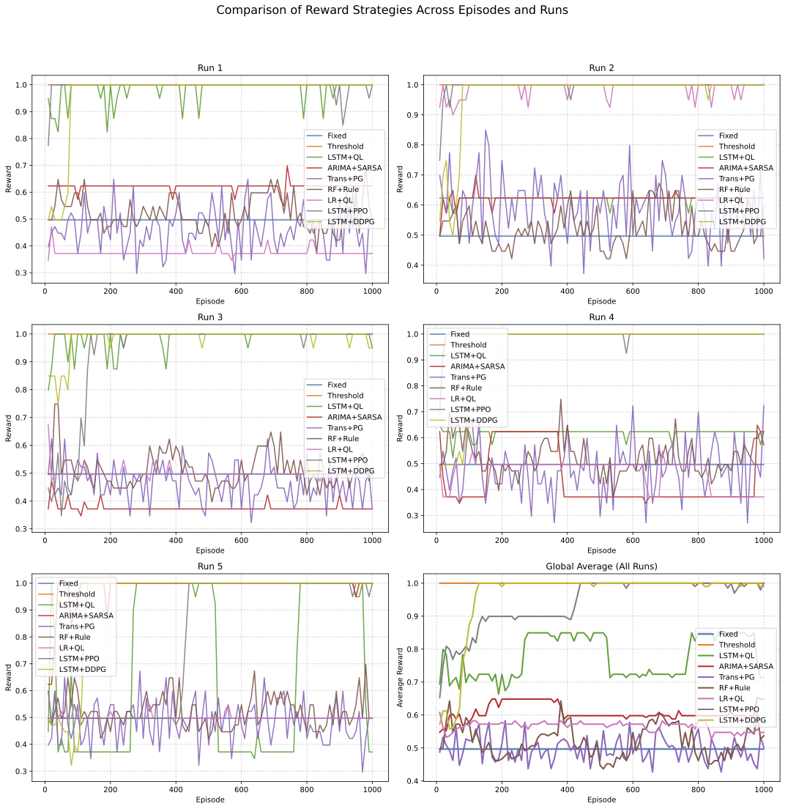
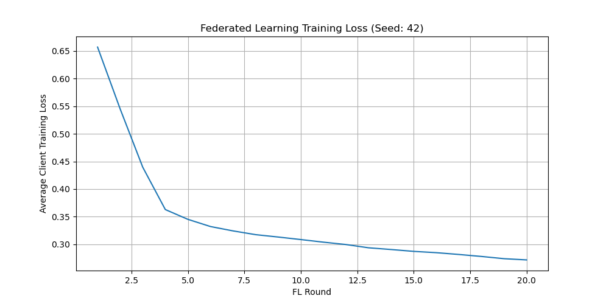
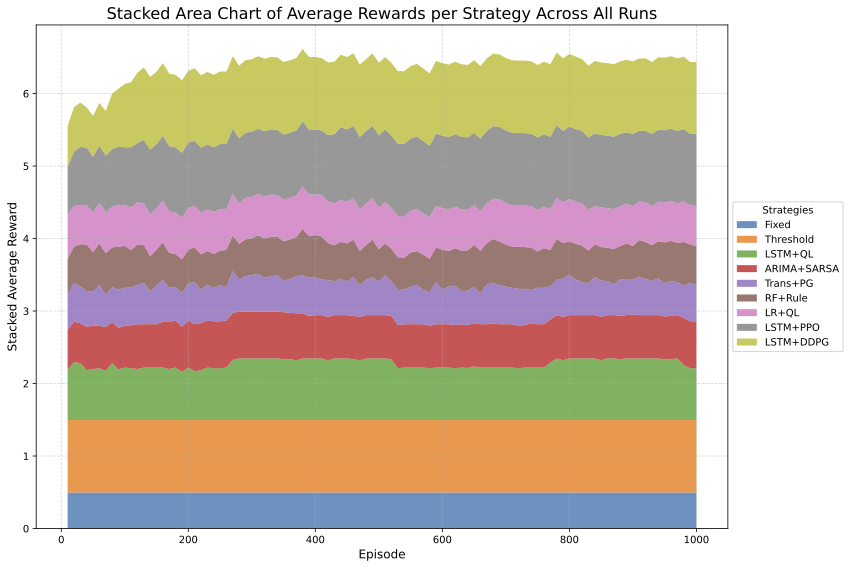

# Adaptive Resource Management System

This repository contains a Python implementation of an adaptive resource management system. The system utilizes various demand prediction techniques and resource allocation strategies, including traditional methods, rule-based approaches, and several reinforcement learning algorithms (Q-Learning, SARSA, Policy Gradient, PPO, DDPG), to dynamically manage resources based on predicted demand. It also includes an experimental Federated Learning setup for training a demand predictor model collaboratively.

## Overview

The core idea is to intelligently allocate a limited number of resources to meet fluctuating demands. The system is designed with modularity in mind, allowing for easy swapping of different prediction and allocation algorithms.

**Key Components:**

1.  **Data Preprocessing:** Normalizes raw time-series data using a moving window to prepare it for prediction models.
2.  **Demand Prediction:** Implements several time-series forecasting methods to predict future demand. Currently includes:
    *   LSTM (Long Short-Term Memory) Network
    *   ARIMA (Autoregressive Integrated Moving Average)
    *   Transformer Network
    *   Random Forest Regressor
    *   Linear Regression
3.  **Resource Allocation:** Determines how many resources to allocate based on the current state and potentially predicted demand. Implements the following strategies:
    *   **Traditional Methods:**
        *   Fixed Allocation: Allocates a constant number of resources.
        *   Threshold-Based Allocation: Allocates resources based on whether recent raw data exceeds a threshold.
    *   **Rule-Based Allocation:** Allocates resources based on predefined rules applied to the *predicted* demand.
    *   **Reinforcement Learning Methods:**
        *   Q-Learning: An off-policy temporal difference learning algorithm.
        *   SARSA (State-Action-Reward-State-Action): An on-policy temporal difference learning algorithm.
        *   Policy Gradient (REINFORCE): A method that directly optimizes the policy function.
        *   PPO (Proximal Policy Optimization): An advanced actor-critic method known for stability.
        *   DDPG (Deep Deterministic Policy Gradient): An actor-critic method for continuous action spaces (adapted here for discrete mapping).
4.  **Adaptive Control:** Monitors the system's performance (reward) and can trigger adaptations, such as adjusting exploration rates (epsilon in Q/SARSA, noise sigma in DDPG) in reinforcement learning agents if performance drops below a threshold.
5.  **Federated Learning (Experimental):**
    *   Includes `FLClient` and `FLServer` classes to simulate a federated learning scenario.
    *   Clients train a local copy of a predictor model (e.g., LSTM) on their own simulated data.
    *   The server aggregates model weights from clients to create an improved global model.

## Getting Started

### Prerequisites

Ensure you have Python 3.6 or higher installed. You will also need the following Python packages:

```bash
pip install numpy pandas torch matplotlib statsmodels scikit-learn
```

You can install all the necessary dependencies using the provided `requirements.txt` file (if available) or install them manually:

```bash
# If requirements.txt exists and lists the packages above:
pip install -r requirements.txt
# Or install manually:
# pip install numpy pandas torch matplotlib statsmodels scikit-learn
```

### Running the Experiment

To run the simulation, execute the main Python script:

```bash
python IntelligentResourceManager_EN.py  # English comments
# Or use the version with Chinese comments:
# python IntelligentResourceManager_CN.py  # 中文注释版本
```

The script will first perform multiple runs of the main experiment, comparing the performance of different resource management strategies, and save the results to CSV files and a plot. It will then run a federated learning simulation to train an LSTM predictor and save a plot of the training loss. Finally, it will run a short test simulation using the FL-trained LSTM predictor combined with a PPO allocator.

### Experiment Setup

The `run_experiment` function defines the parameters for the main simulation runs:

*   `n_resources`: The total number of resource levels (states).
*   `n_actions`: The number of discrete allocation actions available.
*   `episodes`: The number of simulation steps (time steps) per run.
*   `seed`: A seed for reproducibility, incremented for each run.

The main experiment initializes and compares the following resource management approaches:

*   **Traditional:**
    *   Fixed Allocation
    *   Threshold-Based Allocation
*   **Adaptive (combinations of predictors and allocators):**
    *   LSTM Predictor + Q-Learning Allocator
    *   ARIMA Predictor + SARSA Allocator
    *   Transformer Predictor + Policy Gradient Allocator
    *   Random Forest Predictor + Rule-Based Allocator
    *   Linear Regression Predictor + Q-Learning Allocator
    *   LSTM Predictor + PPO Allocator
    *   LSTM Predictor + DDPG Allocator

The federated learning experiment (`run_federated_experiment`) trains an LSTM model using simulated clients and a central server. The final test run evaluates this FL-trained LSTM predictor paired with the PPO allocator.

## Experiment Data Description

This repository generates results from the resource management experiments, stored in two CSV files and plot images.

**Generated Files:**

1.  `experiment_episodes_seed_..._reward_mod_v3.csv`
2.  `experiment_overall_seed_..._reward_mod_v3.csv`
3.  `rewards_comparison_plot_seed_..._reward_mod_v3.png`
4.  `fl_training_loss.png`

(Note: `...` in filenames corresponds to the master seed used).

Below is a detailed explanation of the CSV files.

---

### 1. `experiment_episodes_seed_..._reward_mod_v3.csv`

#### Purpose
This file contains detailed data logged periodically (e.g., every 10 episodes) during each experiment run. It tracks the average reward of different resource management methods over recent episodes, useful for analyzing learning dynamics and performance trends.

#### Structure
The file includes the following columns:

| Column                            | Description                                                                                      |
|-----------------------------------|-------------------------------------------------------------------------------------------------|
| `Run ID`                          | The identifier for the experiment run (e.g., `1`, `2`, etc.).                                   |
| `Episode`                         | The episode number at which the summary was logged.                                            |
| `Fixed Reward`                    | Average reward (last 10 episodes) using the Fixed Allocation method.                            |
| `Threshold Reward`                | Average reward (last 10 episodes) using the Threshold Allocation method.                        |
| `Adaptive (LSTM + QL) Reward`     | Average reward (last 10 episodes) for the adaptive method: LSTM predictor + Q-Learning allocator. |
| `Adaptive (ARIMA + SARSA) Reward` | Average reward (last 10 episodes) for the adaptive method: ARIMA predictor + SARSA allocator.    |
| `Adaptive (Trans + PG) Reward`    | Average reward (last 10 episodes) for the adaptive method: Transformer predictor + Policy Gradient allocator. |
| `Adaptive (RF + Rule) Reward`     | Average reward (last 10 episodes) for the adaptive method: Random Forest predictor + Rule-Based allocator. |
| `Adaptive (LR + QL) Reward`       | Average reward (last 10 episodes) for the adaptive method: Linear Regression predictor + Q-Learning allocator. |
| `Adaptive (LSTM + PPO) Reward`    | Average reward (last 10 episodes) for the adaptive method: LSTM predictor + PPO allocator.       |
| `Adaptive (LSTM + DDPG) Reward`   | Average reward (last 10 episodes) for the adaptive method: LSTM predictor + DDPG allocator.      |

*(Example Data table omitted for brevity, structure is similar to the old README but with added columns)*

---

### 2. `experiment_overall_seed_..._reward_mod_v3.csv`

#### Purpose
This file summarizes the overall performance of different resource management methods across all episodes for each complete experiment run. It provides the mean and standard deviation of the rewards.

#### Structure
The file includes the following columns:

| Column                            | Description                                                                                       |
|-----------------------------------|--------------------------------------------------------------------------------------------------|
| `Run ID`                          | The identifier for the experiment run (e.g., `1`, `2`, etc.).                                    |
| `Fixed Mean`                      | Mean reward across all episodes using the Fixed Allocation method.                               |
| `Fixed Std`                       | Standard deviation of rewards using the Fixed Allocation method.                                 |
| `Threshold Mean`                  | Mean reward across all episodes using the Threshold Allocation method.                           |
| `Threshold Std`                   | Standard deviation of rewards using the Threshold Allocation method.                             |
| `Adaptive (LSTM + QL) Mean`       | Mean reward for the adaptive method: LSTM predictor + Q-Learning allocator.                     |
| `Adaptive (LSTM + QL) Std`        | Standard deviation of rewards for the adaptive method: LSTM predictor + Q-Learning allocator.    |
| `Adaptive (ARIMA + SARSA) Mean`   | Mean reward for the adaptive method: ARIMA predictor + SARSA allocator.                           |
| `Adaptive (ARIMA + SARSA) Std`    | Standard deviation of rewards for the adaptive method: ARIMA predictor + SARSA allocator.         |
| `Adaptive (Trans + PG) Mean`      | Mean reward for the adaptive method: Transformer predictor + Policy Gradient allocator.          |
| `Adaptive (Trans + PG) Std`       | Standard deviation of rewards for the adaptive method: Transformer predictor + Policy Gradient allocator. |
| `Adaptive (RF + Rule) Mean`       | Mean reward for the adaptive method: Random Forest predictor + Rule-Based allocator.             |
| `Adaptive (RF + Rule) Std`        | Standard deviation of rewards for the adaptive method: Random Forest predictor + Rule-Based allocator. |
| `Adaptive (LR + QL) Mean`         | Mean reward for the adaptive method: Linear Regression predictor + Q-Learning allocator.         |
| `Adaptive (LR + QL) Std`          | Standard deviation of rewards for the adaptive method: Linear Regression predictor + Q-Learning allocator. |
| `Adaptive (LSTM + PPO) Mean`      | Mean reward for the adaptive method: LSTM predictor + PPO allocator.                              |
| `Adaptive (LSTM + PPO) Std`       | Standard deviation of rewards for the adaptive method: LSTM predictor + PPO allocator.           |
| `Adaptive (LSTM + DDPG) Mean`     | Mean reward for the adaptive method: LSTM predictor + DDPG allocator.                             |
| `Adaptive (LSTM + DDPG) Std`      | Standard deviation of rewards for the adaptive method: LSTM predictor + DDPG allocator.          |

*(Example Data table omitted for brevity, structure is similar to the old README but with added columns)*

---

### Usage

*   **Dynamic Analysis**: Use the `experiment_episodes...csv` file to visualize how the rewards change over episodes for each method. Plotting reward curves helps assess convergence and stability.
*   **Summary Comparison**: Use the `experiment_overall...csv` file to compare the overall performance (mean and variability) of different resource management methods across multiple runs.
*   **Visual Comparison**: Examine the `rewards_comparison_plot...png` image for a visual summary of the smoothed reward trends from the last run.
*   **FL Performance**: Examine the `fl_training_loss.png` image to see how the average training loss decreased across federated learning rounds. Check the console output for the final performance of the manager using the FL-trained predictor.

## Code Structure

The code is organized into several classes:

*   **Interfaces:**
    *   `IDemandPredictor`: Defines the contract for demand predictors.
    *   `IResourceAllocator`: Defines the contract for resource allocators.
*   **Core Components:**
    *   `DataPreprocessor`: Handles data normalization and windowing.
    *   `AdaptiveController`: Monitors performance for adaptation triggers.
    *   `AdaptiveResourceManager`: Orchestrates prediction, allocation, and adaptation.
    *   `TraditionalResourceManager`: Implements fixed and threshold allocation.
*   **Demand Predictors:**
    *   `LSTMPredictor`, `ARIMAPredictor`, `TransformerPredictor`, `RandomForestPredictor`, `LinearRegressionPredictor`
*   **Resource Allocators:**
    *   `QLearningAllocator`, `SARSAAllocator`, `PolicyGradientAllocator`, `RuleBasedAllocator`, `PPOAllocator`, `DDPGAllocator`
*   **RL Utilities:**
    *   `ReplayBuffer`: For DDPG off-policy learning.
    *   `OUNoise`: For DDPG exploration noise.
    *   `DDPGActor`, `DDPGCritic`: Network structures for DDPG.
*   **Federated Learning:**
    *   `FLClient`: Represents a client performing local training.
    *   `FLServer`: Aggregates client models.
*   **Experiment Execution:**
    *   `run_experiment`: Sets up and runs a single experimental run comparing multiple managers.
    *   `run_federated_experiment`: Runs the FL simulation.
    *   `main`: Executes multiple experimental runs, the FL run, the final FL-model test, and saves results.

**Generated Plots:**







## Contributing

Contributions to this project are welcome! If you have suggestions for improvements, new prediction or allocation algorithms, or bug fixes, please feel free to open an issue or submit a pull request.

## License

This project is licensed under the MIT License.
